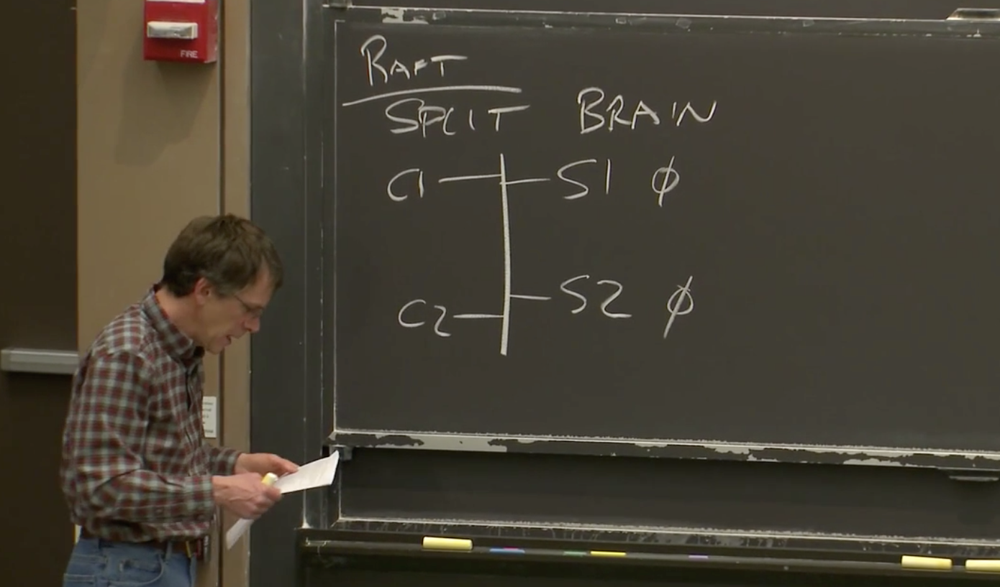

# 6.1 脑裂（Split Brain）

在之前的课程中，我们介绍了几个具备容错特性（fault-tolerant）的系统。如果你有留心的话，你会发现，它们有一个共同的特点。

* MapReduce复制了计算，但是复制这个动作，或者说整个MapReduce被一个单主节点控制。
* GFS以主备（primary-backup）的方式复制数据。它会实际的复制文件内容。但是它也依赖一个单主节点，来确定每一份数据的主拷贝的位置。
* VMware FT，它在一个Primary虚机和一个Backup虚机之间复制计算相关的指令。但是，当其中一个虚机出现故障时，为了能够正确的恢复。需要一个Test-and-Set服务来确认，Primary虚机和Backup虚机只有一个能接管计算任务。

这三个例子中，它们都是一个多副本系统（replication system），但是在背后，它们存在一个共性：它们需要一个单节点来决定，在多个副本中，谁是主（Primary）。

使用一个单节点的好处是，它不可能否认自己。因为只有一个节点，它的决策就是整体的决策。但是使用单节点的缺点是，它本身又是一个单点故障（Single Point of Failure）。

所以，你可以认为我们前面介绍的这些系统，它们将系统容错的关键点，转移到了这个单点上。这个单点，会在系统出现局部故障时，选择数据的主拷贝来继续工作。使用单点的原因是，我们需要避免脑裂（Split-Brain）。当出现故障时，我们之所以要极其小心的决定数据的主拷贝，是因为，如果不这么做的话，我们可能需要面临脑裂的场景。

为了让同学们更深入的了解脑裂，我接下来会说明脑裂带来的问题，以及为什么这是个严重的问题。现在，假设我们将VMware FT中的Test-and-Set服务构建成多副本的。之前这是一个单点服务，而VMware FT依赖这个Test-and-Set服务来确定Primary虚机，所以，为了提高系统的容错性，我们来构建一个多副本的Test-and-Set服务。我们来看一下，为什么出现故障时，很难避免脑裂。

现在，我们来假设我们有一个网络，这个网络里面有两个服务器（S1，S2），这两个服务器都是我们Test-and-Set服务的拷贝。这个网络里面还有两个客户端（C1，C2），它们需要通过Test-and-Set服务确定主节点是谁。在这个例子中，这两个客户端本身就是VMware FT中的Primary和Backup虚拟机。

如果这是一个Test-and-Set服务，那么你知道这两个服务器中的数据记录将从0开始。任意一个客户端发送Test-and-Set指令，这个指令会将服务器中的状态设置成1。所以在这个图里面，两个服务器都应该设置成1，然后将旧的值0，返回给客户端。本质上来说，这是一种简化了的锁服务。

当一个客户端可以与其中一个服务器通信，但是不能与另一个通信时，有可能出现脑裂的问题。我们假设，客户端发送请求时，它会将请求同时发送给两个服务器。这样，我们就需要考虑，当某个服务器不响应时，客户端该怎么做？或者说，某个服务器不响应时，整个系统该如何响应？更具体点，我们假设C1可以访问S1但是不能访问S2，系统该如何响应？

一种情况是，我们必然不想让C1只与S1通信。因为，如果我们只将C1的请求设置给S1，而不设置给S2，会导致S2的数据不一致。所以，我们或许应该规定，对于任何操作，客户端必须总是与两个服务器交互，而不是只与其中一个服务器交互。但是这是一个错误的想法，为什么呢？因为这里根本就没有容错。这里甚至比只使用一个服务器更糟。因为当两个服务器中的一个故障了或者失联了，我们的系统就不能工作了。对于一个单点的服务，我们只依赖一个服务器。现在我们有两个服务器，并且两个服务器都必须一致在线，这里的难度比单个服务器更大。如果这种方式不是容错的，我们需要一种行之有效的方法。

另一个明显的答案是，如果客户端不能同时与两个服务器交互，那它就与它能连通的那个服务器交互，同时认为另一个服务器已经关机了。为什么这也是一个错误的答案呢？因为，我们的故障场景是，另一个服务器其实还开机着。我们假设我们经历的实际问题并不是这个服务器关机了，因为如果关机了对我们来说其实更好。实际情况可能更糟糕，实际可能是网络线路出现了故障，从而导致C1可以与S1交互，但是不能与S2交互。同时，C2可以与S2交互，但是不能与S1交互。现在我们规定，如果一个客户端连接了两个服务器，为了达到一定的容错性，客户端只与其中一个服务器交互也应该可以正常工作。但是这样就不可避免的出现了这种情况：假设这根线缆中断了，将网络分为两个部分。

.png>)

C1发送Test-and-Set请求给S1，S1将自己的状态设置为1，并返回之前的状态0给C1。

.png>)

这就意味着，C1会认为自己持有锁。如果这是一个VMware FT，C1对应的虚拟机会认为自己可以成为主节点。

但是同时，S2里面的状态仍然是0。所以如果现在C2也发送了一个Test-and-Set请求，本来应该发送给两个服务器，但是现在从C2看来，S1不能访问，根据之前定义的规则，那就发送给S2吧。同样的C2也会认为自己持有了锁。如果这个Test-and-Set服务被VMware FT使用，那么这两个VMware 虚机都会认为自己成为了主虚拟机而不需要与另一个虚拟机协商，所以这是一个错误的场景。

所以，在这种有两个拷贝副本的配置中，看起来我们只有两种选择：要么等待两个服务器响应，那么这个时候就没有容错能力；要么只等待一个服务器响应，那么就会进入错误的场景，而这种错误的场景，通常被称为脑裂。

这基本是上世纪80年代之前要面临的挑战。但是，当时又的确有多副本系统的要求。例如，控制电话交换机的计算机系统，或者是运行银行系统的计算机系统。当时的人们在构建多副本系统时，需要排除脑裂的可能。这里有两种技术：

* 第一种是构建一个不可能出现故障的网络。实际上，不可能出现故障的网络一直在我们的身边。你们电脑中，连接了CPU和内存的线路就是不可能出现故障的网络。所以，带着合理的假设和大量的资金，同时小心的控制物理环境，比如不要将一根网线拖在地上，让谁都可能踩上去。如果网络不会出现故障，这样就排除了脑裂的可能。这里做了一些假设，但是如果有足够的资金，人们可以足够接近这个假设。当网络不出现故障时，那就意味着，如果客户端不能与一个服务器交互，那么这个服务器肯定是关机了。
* 另一种就是人工解决问题，不要引入任何自动完成的操作。默认情况下，客户端总是要等待两个服务器响应，如果只有一个服务器响应，永远不要执行任何操作。相应的，给运维人员打电话，让运维人员去机房检查两个服务器。要么将一台服务器直接关机，要么确认一下其中一台服务器真的关机了，而另一个台还在工作。所以本质上，这里把人作为了一个决策器。而如果把人看成一台电脑的话，那么这个人他也是个单点。

所以，很长一段时间内，人们都使用以上两种方式中的一种来构建多副本系统。这虽然不太完美，因为人工响应不能很及时，而不出现故障的网络又很贵，但是这些方法至少是可行的。
